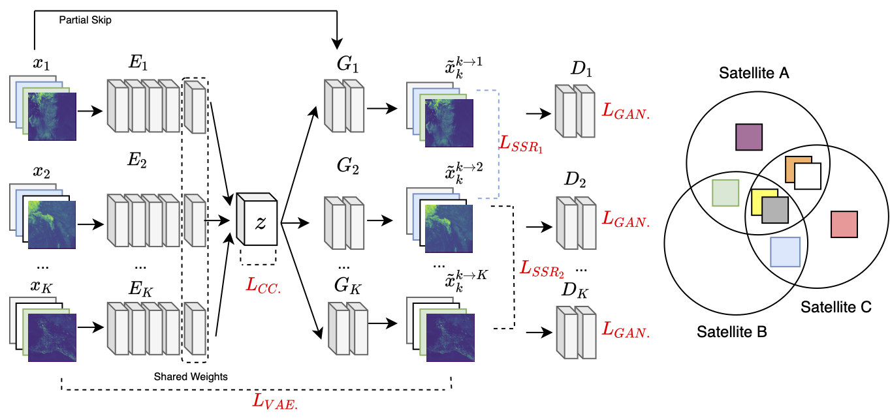

## Spectral Synthesis for Geostationary Satellite-to-Satellite Translation

**Authors:** Thomas Vandal, Daniel McDuff, Weile Wang, Kate Duffy, Andrew Michaelis, and Rama Nemani  
**Abstract:** Earth-observing satellites carrying multispectral sensors are widely used to monitor the physical and biological states of the atmosphere, land, and oceans. These satellites have different vantage points above the Earth and different spectral imaging bands resulting in inconsistent imagery from one to another. This presents challenges in building downstream applications. What if we could generate synthetic bands for existing satellites from the union of all domains? We tackle the problem of generating synthetic spectral imagery for multispectral sensors as an unsupervised image-to-image translation problem modeled with a variational autoencoder (VAE) and generative adversarial network (GAN) architecture. Our approach introduces a novel shared spectral reconstruction loss to constrain the high-dimensional feature space of multispectral images. Simulated experiments performed by dropping one or more spectral bands show that cross-domain reconstruction outperforms measurements obtained from a second vantage point. Our proposed approach enables the synchronization of multispectral data and provides a basis for more homogeneous remote sensing datasets.  
**Journal Publication:** [IEEE Transactions on Geoscience and Remote Sensing (TGRS)](https://ieeexplore.ieee.org/document/9462910)  
**Code:** [https://github.com/tjvandal/unsupervised-spectral-synthesis](https://github.com/tjvandal/unsupervised-spectral-synthesis)

## Temporal Interpolation of Geostationary Satellite Imagery With Optical Flow
 

<iframe width="560" height="315" src="https://www.youtube.com/embed/NeMXPQw3CJU?controls=0" frameborder="0" allow="accelerometer; autoplay; encrypted-media; gyroscope;" allowfullscreen></iframe>
  
**DeepSpatial 2020 Best Spotlight Presentation**  
**Authors:** Thomas Vandal & Rama Nemani  
**Abstract:** Applications of satellite data in areas such as weather tracking and modeling, ecosystem monitoring, wildfire detection, and landcover change are heavily dependent on the trade-offs related to the spatial, spectral and temporal resolutions of the observations. For instance, geostationary weather tracking satellites are designed to take hemispherical snapshots many times throughout the day but sensor hardware limits data collection. In this work we tackle this limitation by developing a method for temporal upsampling of multi-spectral satellite imagery using optical flow video interpolation deep convolutional neural networks. The presented model, extends Super SloMo (SSM) from single optical flow estimates to multichannel where flows are computed per wavelength band. We apply this technique on up to 8 multispectral bands of GOES-R/Advanced Baseline Imager mesoscale dataset to temporally enhance full disk hemispheric snapshots from 15 minutes to 1 minute. Through extensive experimentation with a multi-terabyte dataset, we show SSM greatly outperforms the linear interpolation baseline and that multichannel optical flows improves performance on GOES/ABI. Furthermore, we discuss challenges and open questions related to temporal interpolation of multispectral geostationary satellite imagery.  
**Journal Publication:** [IEEE Transactions in Neural Networks and Learning Systems (TNNLS))](https://ieeexplore.ieee.org/document/9511282) (2021).  
**Workshop Publication:** [1st ACM SIGKDD Workshop on Deep Learning for Spatiotemporal Data, Applications, and Systems](http://mason.gmu.edu/~lzhao9/venues/DeepSpatial2020/), (2020).
**Code:** [https://github.com/tjvandal/geostationary-superslomo](https://github.com/tjvandal/geostationary-superslomo)

## Quantifying Uncertainty in Discrete-Continuous and Skewed Data with Bayesian Deep Learning 

**KDD 2018 - Research Track**  
**Authors:** Thomas Vandal, Evan Kodra, Sangram Ganguly, Jennifer Dy, Rama Nemani, & Auroop Ganguly  
**Abstract:** Deep Learning (DL) methods have been transforming computer vision with innovative adaptations to other domains including climate change. For DL to pervade Science and Engineering (S&EE) applications where risk management is a core component, well-characterized uncertainty estimates must accompany predictions. However, S&E observations and model-simulations often follow heavily skewed distributions and are not well modeled with DL approaches, since they usually optimize a Gaussian, or Euclidean, likelihood loss. Recent developments in Bayesian Deep Learning (BDL), which attempts to capture uncertainties from noisy observations, aleatoric, and from unknown model parameters, epistemic, provide us a foundation. Here we present a discrete-continuous BDL model with Gaussian and lognormal likelihoods for uncertainty quantification (UQ). We demonstrate the approach by developing UQ estimates on “DeepSD’‘, a super-resolution based DL model for Statistical Downscaling (SD) in climate applied to precipitation, which follows an extremely skewed distribution. We find that the discrete-continuous models outperform a basic Gaussian distribution in terms of predictive accuracy and uncertainty calibration. Furthermore, we find that the lognormal distribution, which can handle skewed distributions, produces quality uncertainty estimates at the extremes. Such results may be important across S&E, as well as other domains such as finance and economics, where extremes are often of significant interest. Furthermore, to our knowledge, this is the first UQ model in SD where both aleatoric and epistemic uncertainties are characterized.  
**Conference Publication:** [24rd ACM SIGKDD Conference on Knowledge Discovery and Data Mining](https://www.kdd.org/kdd2018/accepted-papers/view/quantifying-uncertainty-in-discrete-continuous-and-skewed-data-with-bayesia)  
**Code:** [https://github.com/tjvandal/discrete-continuous-bdl](https://github.com/tjvandal/discrete-continuous-bdl)

## DeepSD: Generating high resolution climate change projections through single image super-Resolution  

{:width="72%"}
{:width="26%"}

**KDD 2017 - Applied Data Science Track - Runner-up BEST PAPER**  
**Authors:** Thomas Vandal, Evan Kodra, Sangram Ganguly, Andy Michaelis, Rama Nemani, and Auroop Ganguly  
**Abstract:** The impacts of climate change are felt by most critical systems, such as infrastructure, ecological systems, and power-plants. However, contemporary Earth System Models (ESM) are run at spatial resolutions too coarse for assessing effects this localized. Local scale projections can be obtained using statistical downscaling, a technique which uses historical climate observations to learn a low-resolution to high-resolution mapping. Depending on statistical modeling choices, downscaled projections have been shown to vary significantly terms of accuracy and reliability. The spatio-temporal nature of the climate system motivates the adaptation of super-resolution image processing techniques to statistical downscaling. In our work, we present DeepSD, a generalized stacked super resolution convolutional neural network (SRCNN) framework for statistical downscaling of climate variables. DeepSD augments SRCNN with multi-scale input channels to maximize predictability in statistical downscaling. We provide a comparison with Bias Correction Spatial Disaggregation as well as three Automated-Statistical Downscaling approaches in downscaling daily precipitation from 1 degree (~100km) to 1/8 degrees (~12.5km) over the Continental United States. Furthermore, a framework using the NASA Earth Exchange (NEX) platform is discussed for downscaling more than 20 ESM models with multiple emission scenarios. 
**Conference Publication:** [23rd ACM SIGKDD Conference on Knowledge Discovery and Data Mining](https://www.kdd.org/kdd2017/papers/view/deepsd-generating-high-resolution-climate-change-projections-through-single) 
**Code:** [https://github.com/tjvandal/deepsd](https://github.com/tjvandal/deepsd)
